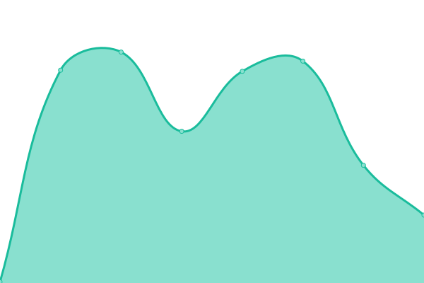
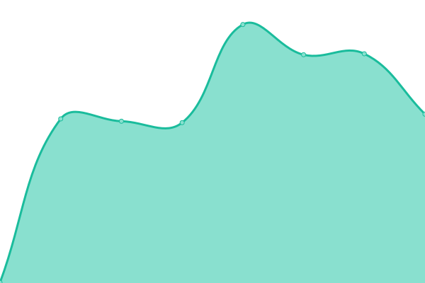
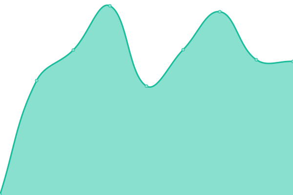

# [📈 Live Status](https://status.catacloud.com): <!--live status--> **🟧 Partial outage**

This repository contains the open-source uptime monitor and status page for [Catacloud](https://www.catacloud.com), powered by [Upptime](https://github.com/upptime/upptime).

With [Upptime](https://upptime.js.org), you can get your own unlimited and free uptime monitor and status page, powered entirely by a GitHub repository. We use [Issues](https://github.com/Catacloud/statuspage/issues) as incident reports, [Actions](https://github.com/Catacloud/statuspage/actions) as uptime monitors, and [Pages](https://status.catacloud.com) for the status page.

<!--start: status pages-->
<!-- This summary is generated by Upptime (https://github.com/upptime/upptime) -->
<!-- Do not edit this manually, your changes will be overwritten -->
<!-- prettier-ignore -->
| URL | Status | History | Response Time | Uptime |
| --- | ------ | ------- | ------------- | ------ |
|  [Website](https://www.catacloud.com) | 🟩 Up | [website.yml](https://github.com/Catacloud/statuspage/commits/HEAD/history/website.yml) | 

 1297ms
     
 | 

<a href="https://status.catacloud.com/history/website">100.00%</a>
    

|  [Web-app](https://app.catacloud.com) | 🟩 Up | [web-app.yml](https://github.com/Catacloud/statuspage/commits/HEAD/history/web-app.yml) | 

 155ms
     
 | 

<a href="https://status.catacloud.com/history/web-app">100.00%</a>
    

|  [Identity Server](https://login.catacloud.com/.well-known/openid-configuration) | 🟩 Up | [identity-server.yml](https://github.com/Catacloud/statuspage/commits/HEAD/history/identity-server.yml) | 

 441ms
     
 | 

<a href="https://status.catacloud.com/history/identity-server">100.00%</a>
    

|  [GraphQL API](https://api.catacloud.com) | 🟥 Down | [graph-ql-api.yml](https://github.com/Catacloud/statuspage/commits/HEAD/history/graph-ql-api.yml) | 

 437ms
     
 | 

<a href="https://status.catacloud.com/history/graph-ql-api">100.00%</a>
    

<!--end: status pages-->

[**Visit our status website →**](https://status.catacloud.com)

## 📄 License

- Powered by: [Upptime](https://github.com/upptime/upptime)
- Code: [MIT](./LICENSE) © [Catacloud](https://www.catacloud.com)
- Data in the `./history` directory: [Open Database License](https://opendatacommons.org/licenses/odbl/1-0/)
